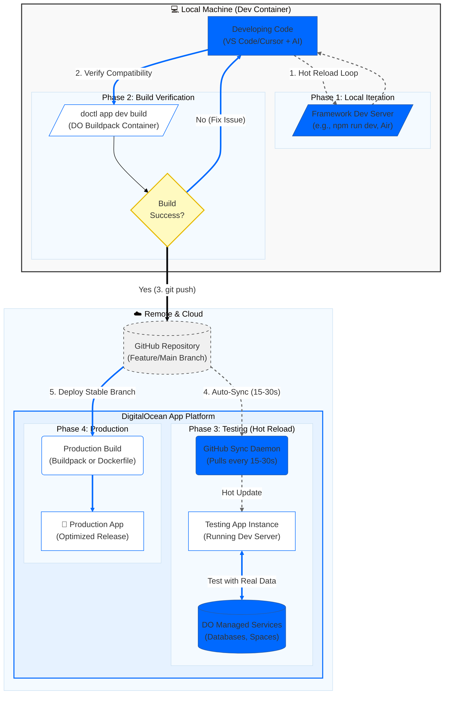

# do-app-platform-ai-dev-workflow

**An opinionated workflow for AI-assisted development on DigitalOcean App Platform. Test locally → Deploy to testing (hot-reload) → Deploy to production (optimized).**

Designed for AI assistants like Cursor, GitHub Copilot, and Claude to provide a hands-free experience for rapid iteration at scale.

[](https://cloud.digitalocean.com/apps/new?repo=https://github.com/bikram20/do-app-platform-ai-dev-workflow/tree/main)

## 🎯 What Is This?

This repository provides a complete, end-to-end development workflow that enables:

1. **Local Development** - Fast iteration in a devcontainer with framework dev tools
2. **Local Build Verification** - Test production compatibility before pushing
3. **Rapid Testing on App Platform** - Hot-reload environment with 15-30s sync cycles
4. **Production Deployment** - Optimized builds with full confidence

**The Problem It Solves:**
- Traditional workflow: Code → Push → Build (5-10 min) → Deploy → Test → Fix → Repeat
- This workflow: Local dev → Verify build → Push → Hot-reload testing (15-30s) → Production

## 🔄 Complete Workflow



## 📁 Repository Structure

```
do-app-platform-ai-dev-workflow/
├── .devcontainer/          # Local development container setup
├── hot-reload-template/        # Hot-reload template for App Platform
│   ├── examples/          # Reusable dev_startup.sh scripts
│   └── app-examples/      # Complete working sample apps
├── build-locally.sh       # Helper: Local build verification
├── workflow-check.sh      # Helper: Context validation
├── README.md              # This file
└── agent.md               # AI assistant guide
```

## 🚀 Quick Start

### Full Workflow (Recommended)

1. **Clone this repository**
   ```bash
   git clone https://github.com/your-org/do-app-platform-ai-dev-workflow.git
   cd do-app-platform-ai-dev-workflow
   ```

2. **Open in VSCode/Cursor/AntiGravity** - The `.devcontainer/` will set up your environment

3. **Start developing** - Use framework dev tools (npm run dev, uvicorn, etc.)

4. **Verify production build** - Run `./build-locally.sh` before pushing

5. **Set up hot-reload testing** - Deploy `hot-reload-template/` to App Platform

6. **Deploy to production** - Use optimized buildpack or your Dockerfile

### Modular Usage

**Just want local dev?**
- Copy `.devcontainer/` to your project
- You get: doctl, Docker, database clients, all runtimes

**Just want hot-reload on App Platform?**
- Use `hot-reload-template/` independently
- Deploy it, point it to your repo, get 15-30s sync cycles

**Starting a new app?**
- Copy from `hot-reload-template/app-examples/` (go, python, nextjs)
- You get: working `dev_startup.sh`, `appspec.yaml` for testing

**Full workflow?**
- Use everything together for maximum productivity

## 📖 Detailed Workflow

### Phase 1: Local Development

Work in the devcontainer using your framework's native tools:
- **Next.js:** `npm run dev`
- **FastAPI:** `uvicorn main:app --reload`
- **Go:** `air` (live reload)
- **Express:** `nodemon server.js`

**Why:** Fastest iteration, immediate feedback, AI assistants can help in real-time.

### Phase 2: Local Build Verification

Before pushing, verify your build will work in production:

```bash
# Using helper script
./build-locally.sh

# Or directly
doctl app dev build
```

**Why:** Catches build issues early (before the 5-10 minute deploy cycle). Uses the same buildpack containers as App Platform production.

### Phase 3: Hot-Reload Testing on App Platform

Deploy the `hot-reload-template/` to create a testing environment:

1. **Deploy the template:**
   ```bash
   cd hot-reload-template
   doctl apps create --spec app.yaml
   ```

2. **Configure environment variables:**
   - `GITHUB_REPO_URL` - Your app repository
   - `GITHUB_SYNC_INTERVAL` - "15" or "30" seconds
   - `RUN_COMMAND` - "bash dev_startup.sh" (or leave blank if script exists in repo)

3. **Push to GitHub** - Changes appear in testing within 15-30 seconds

**Why:** Test with real App Platform services (databases, Spaces) without full rebuilds. Rapid feedback loop.

**Important:** The `hot-reload-template/Dockerfile` is **only for testing**. Production uses buildpack or your own Dockerfile.

### Phase 4: Production Deployment

Once testing passes, deploy to production:

**Option A: Buildpack (Recommended)**
- App Platform automatically detects your framework
- No Dockerfile needed
- Optimized builds

**Option B: Your Own Dockerfile**
- If you have custom build requirements
- Keep your existing Dockerfile
- **You don't need to replace it** - the `hot-reload-template/Dockerfile` is only for testing

**Key Point:** Create separate `appspec.yaml` files:
- **Testing:** Uses `hot-reload-template/Dockerfile` for hot-reload
- **Production:** Uses buildpack or your Dockerfile for optimized builds

## 🛠️ Components

### `.devcontainer/`
Local development environment with:
- doctl (DigitalOcean CLI)
- Docker
- All runtimes (Node.js, Python, Go, Rust)
- Database clients (PostgreSQL, MongoDB, MySQL)
- Pre-configured for App Platform development

### `hot-reload-template/`
Hot-reload template for App Platform testing:
- **Dockerfile** - Dev container with GitHub sync
- **scripts/** - Sync daemon, health server, startup orchestration
- **examples/** - Reusable `dev_startup.sh` scripts with error handling
- **app-examples/** - Complete working sample apps

**Note:** The Dockerfile is for **testing only**. Production uses buildpack or your Dockerfile.

### Helper Scripts

**`build-locally.sh`** - Wraps `doctl app dev build` with helpful defaults
```bash
./build-locally.sh                    # Build using default spec
./build-locally.sh my-component       # Build specific component
./build-locally.sh --spec app.yaml    # Use custom spec
```

**`workflow-check.sh`** - Validates folder context and workflow state
```bash
./workflow-check.sh                   # Check current context
./workflow-check.sh --verbose         # Detailed information
```

## 🎓 Why This Workflow?

### Traditional Workflow Problems
- 5-10 minute deploy cycles
- Build failures discovered late
- Slow feedback loops
- Integration issues found only in production

### This Workflow Benefits
- ✅ Build compatibility verified before pushing (saves 5-10 min cycles)
- ✅ Rapid iteration in testing (15-30s feedback)
- ✅ Real service testing before production
- ✅ Hands-free experience for AI assistants
- ✅ Catch build issues early, not in production

## 📚 Documentation

- **[agent.md](agent.md)** - Comprehensive guide for AI assistants
- **[hot-reload-template/README.md](hot-reload-template/README.md)** - Hot-reload template setup
- **[hot-reload-template/app-examples/](hot-reload-template/app-examples/)** - Working sample apps

## 🔑 Key Concepts

### Testing vs Production

**Testing Environment (Hot-Reload):**
- Uses `hot-reload-template/Dockerfile`
- GitHub sync every 15-30 seconds
- Dev server with hot-reload
- Fast iteration, not optimized

**Production Environment:**
- Uses buildpack **OR** your own Dockerfile
- Optimized builds
- No hot-reload (not needed)
- Separate `appspec.yaml` configuration

### Dockerfile Usage

**If you have your own Dockerfile:**
- ✅ Keep it for production
- ✅ Use `dev_startup.sh` from `hot-reload-template/examples/` (for testing)
- ✅ Create separate `appspec.yaml` files for testing and production
- ❌ Don't replace your Dockerfile with `hot-reload-template/Dockerfile`

**If you don't have a Dockerfile:**
- ✅ Use buildpack for production (automatic)
- ✅ Use `hot-reload-template/Dockerfile` for testing (hot-reload)

## 🤝 Contributing

This is an opinionated workflow. If you want to:
- **Extend the template:** See `hot-reload-template/CUSTOMIZATION.md`
- **Add examples:** Add to `hot-reload-template/app-examples/`
- **Improve workflow:** Update `agent.md` and this README

## 📖 Additional Resources

- [DigitalOcean App Platform Docs](https://docs.digitalocean.com/products/app-platform/)
- [Build Locally Guide](https://docs.digitalocean.com/products/app-platform/how-to/build-locally/)
- [App Spec Reference](https://docs.digitalocean.com/products/app-platform/reference/app-spec/)

---

**For AI Assistants:** See [agent.md](agent.md) for complete workflow guidance, decision trees, and automation instructions.
