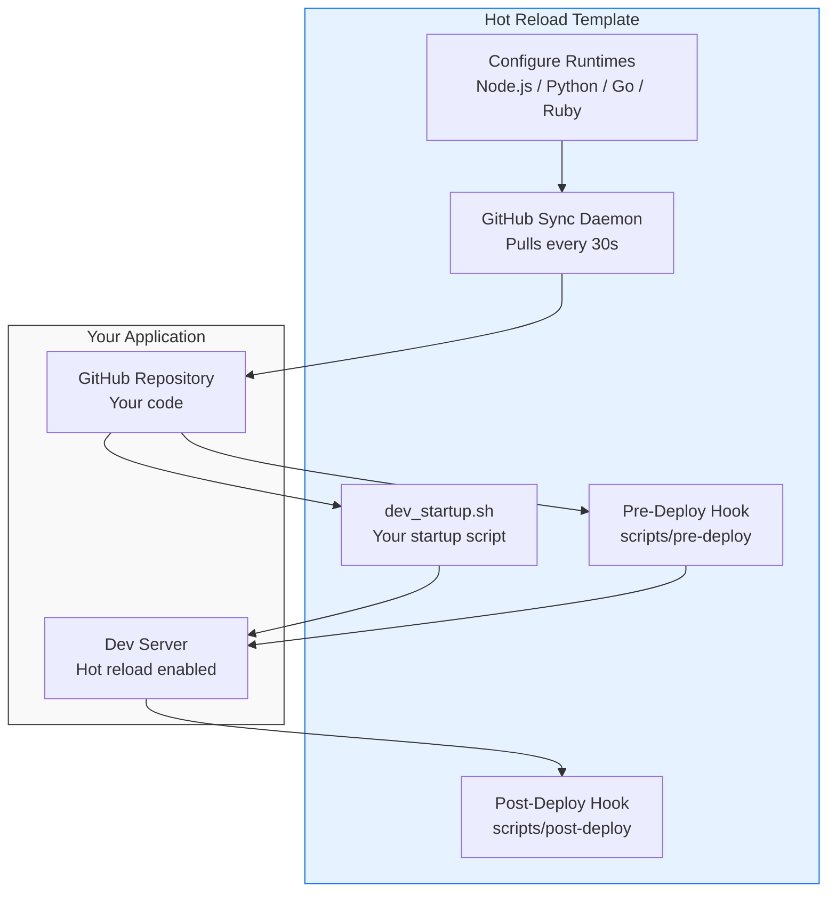

# DigitalOcean App Platform Dev Template

**Deploy once, iterate fast.** This template continuously syncs your GitHub repo and runs your dev server—no rebuild loop.

[](https://cloud.digitalocean.com/apps/new?repo=https://github.com/bikram20/do-app-platform-ai-dev-workflow/tree/main)

## How It Works



**The Flow:**
1. **Template** - Deploy this template to App Platform
2. **Configure** - Choose runtimes (Node.js, Python, Go, Ruby) via build args
3. **Point to Your Code** - Set `GITHUB_REPO_URL` and `GITHUB_REPO_FOLDER` (or use default Next.js sample)
4. **Startup Script** - Template runs `dev_startup.sh` from your repo (handles deps, hot reload)
5. **Hooks** - Optional `scripts/pre-deploy` and `scripts/post-deploy` run on code changes
6. **Sync** - Changes sync every 30s, dev server auto-restarts

## 2-Minute Quickstart

**Click "Deploy to DO" → Done!** The template deploys with a working Next.js sample app.

1. **Deploy** - Click the "Deploy to DO" button above
2. **Wait** - Container builds (~2-3 min), then Next.js app starts automatically
3. **Visit** - Open your app URL, see the sample app running
4. **Inspect** - Check App Platform UI → Settings → Environment Variables to see:
   - `GITHUB_REPO_URL` → Points to this monorepo
   - `GITHUB_REPO_FOLDER` → `hot-reload-template/app-examples/nextjs-sample-app`
   - `DEV_START_COMMAND` → `bash dev_startup.sh`
   - Pre/post deploy hooks configured

**That's it!** You now have a working hot-reload environment. Make changes to the Next.js sample, push to GitHub, and see them appear in ~30 seconds.

### Use Your Own App

To point the template at your own repository:

1. **App Platform UI** → Settings → Environment Variables
2. Update:
   - `GITHUB_REPO_URL` → Your repo URL
   - `GITHUB_REPO_FOLDER` → Leave empty (or subfolder for monorepos)
   - `DEV_START_COMMAND` → `bash dev_startup.sh` (or your command)
3. **Build Arguments** → Enable only runtimes you need:
   - Node.js? `INSTALL_NODE=true`, others=false
   - Python? `INSTALL_PYTHON=true`, others=false
   - Go? `INSTALL_GOLANG=true`, others=false
4. **Redeploy** → Your app syncs and runs

## Configuration

### Runtime Environment Variables

| Variable | Required | Default | Description |
|----------|----------|---------|-------------|
| `GITHUB_REPO_URL` | Yes* | Next.js sample | Your application repository URL |
| `GITHUB_REPO_FOLDER` | No | `hot-reload-template/app-examples/nextjs-sample-app` | Subfolder within repo (for monorepos) |
| `GITHUB_BRANCH` | No | `main` | Branch to sync |
| `GITHUB_TOKEN` | No | - | GitHub token for private repos (stored as secret) |
| `DEV_START_COMMAND` | No | `bash dev_startup.sh` | Command to start your dev server |
| `WORKSPACE_PATH` | No | `/workspaces/app` | Where to sync your repo |
| `GITHUB_SYNC_INTERVAL` | No | `30` | How often to sync repo (seconds) |
| `ENABLE_DEV_HEALTH` | No | `false` | Bootstrap health server; set `true` if your app doesn't have health endpoint |

\* Defaults to Next.js sample app for instant demo.

### Build Arguments

Choose runtimes you need (smaller selection = faster builds):

| Build Arg | Default | When to Enable |
|-----------|---------|----------------|
| `INSTALL_NODE` | `true` | Node.js, Next.js, Remix, Express apps |
| `INSTALL_PYTHON` | `false` | Python, FastAPI, Django, Flask apps |
| `INSTALL_GOLANG` | `false` | Go apps |
| `INSTALL_RUST` | `false` | Rust apps |
| `INSTALL_RUBY` | `false` | Ruby, Rails, Sinatra apps |
| `INSTALL_POSTGRES` | `true` | PostgreSQL client tools (psql, libpq) |
| `INSTALL_MONGODB` | `false` | MongoDB client tools (mongosh) |
| `INSTALL_MYSQL` | `false` | MySQL client tools (mysql cli) |

## Write Your dev_startup.sh

**Recommended:** Copy a proven example from `examples/` directory. These handle:
- Automatic lock file conflict resolution (`package-lock.json`, `go.sum`, `uv.lock`)
- Hard rebuild on dependency errors
- Hot reload with file watching

**Available examples:**
- `examples/dev_startup.sh.nextjs` - Next.js with nodemon, handles npm peer deps
- `examples/dev_startup.sh.python` - FastAPI with uv, handles lock conflicts
- `examples/dev_startup.sh.golang` - Go with file watching, handles go.sum conflicts

**Quick start:**
1. Copy the appropriate example to your repo as `dev_startup.sh`
2. Customize if needed (port, command, etc.)
3. Script handles errors, conflicts, and hot reload automatically

**Simple example (Next.js):**
```bash
#!/bin/bash
cd /workspaces/app
npm install
npm run dev -- --hostname 0.0.0.0 --port 8080
```

Your script should:
- Install dependencies
- Start a dev server on port `8080`
- Support hot reload for fast iteration

## Pre-Deploy and Post-Deploy Hooks

Execute scripts at deployment lifecycle points. Jobs run **only when git commit changes** (not every 30s sync).

### PRE_DEPLOY (Strict Mode)

Runs **before** app starts. Must succeed or container exits.

**Use for:** Database migrations, schema updates, environment validation

**Configuration:**
```yaml
envs:
  - key: PRE_DEPLOY_FOLDER
    value: scripts/pre-deploy
  - key: PRE_DEPLOY_COMMAND
    value: bash migrate.sh
  - key: PRE_DEPLOY_TIMEOUT
    value: "300"  # seconds
```

### POST_DEPLOY (Lenient Mode)

Runs **after** app starts (background). Failure logged but app continues.

**Use for:** Data seeding, cache warming, notifications

**Configuration:**
```yaml
envs:
  - key: POST_DEPLOY_FOLDER
    value: scripts/post-deploy
  - key: POST_DEPLOY_COMMAND
    value: bash seed.sh
  - key: POST_DEPLOY_TIMEOUT
    value: "300"  # seconds
```

**When Jobs Execute:**
- **Initial startup**: Always runs before/after app starts
- **Continuous sync (every 30s)**: Commit changed → Execute jobs, Commit unchanged → Skip jobs

See working examples in `app-examples/nextjs-sample-app/scripts/` with detailed READMEs.

## Monorepo Support

Deploy applications from monorepos by syncing specific subfolders.

**Configuration:**
```yaml
envs:
  - key: GITHUB_REPO_URL
    value: https://github.com/myorg/monorepo
  - key: GITHUB_REPO_FOLDER
    value: apps/backend
  - key: GITHUB_BRANCH
    value: feature/new-api
```

**How it works:**
1. Sync script clones full monorepo to `/tmp/monorepo-cache/`
2. Only specified folder synced to `/workspaces/app`
3. Your `dev_startup.sh` runs from within that folder
4. Changes sync every 30 seconds by default

## Working Examples

Complete working sample applications in [`app-examples/`](app-examples/):

- **`app-examples/go-sample-app/`** - Go application with hot-reload
- **`app-examples/python-fastapi-sample/`** - Python FastAPI application with hot-reload
- **`app-examples/nextjs-sample-app/`** - Next.js application with hot-reload (default)
- **`app-examples/ruby-rails-sample/`** - Rails application with hot-reload

Each example includes:
- Complete `dev_startup.sh` script
- `appspec.yaml` configured for **testing/hot-reload** environment
- Working application code
- Pre/post deploy hook examples

**Important:** The `appspec.yaml` in these examples is for **testing/hot-reload**. For **production**, create a separate `appspec.yaml` that uses buildpack or your own Dockerfile (not the `hot-reload-template/Dockerfile`).

## Key Behaviors

- **Git sync is continuous** - Your app is NOT auto-restarted. Use a dev server with hot reload (see examples above).
- **Health server is temporary** - Disable via `ENABLE_DEV_HEALTH=false` once your app handles health checks.
- **Runtimes are modular** - Enable only what you need for faster builds and smaller images.
- **Environment variables are runtime** - Changes to env vars take effect on redeploy (no rebuild needed).
- **Build arguments are build-time** - Changes to build args require a full rebuild.
- **Lock file conflicts auto-resolved** - The sync script and example dev_startup.sh scripts automatically detect and resolve merge conflicts in lock files.
- **Hard rebuild on errors** - Example scripts automatically perform clean rebuilds when dependency installation fails.

## Deploy Options

**One-click (recommended):**
Use the "Deploy to DO" button and configure via UI after first deploy

**App Platform UI:**
Create App → GitHub → select this repo → configure env vars/build args → deploy

**CLI (advanced):**
Edit `app.yaml` with your values, then: `doctl apps create --spec app.yaml`

**Local smoke test:**
```bash
docker build -t dev-env .
docker run -p 8080:8080 \
  -e GITHUB_REPO_URL=https://github.com/user/your-repo.git \
  -e DEV_START_COMMAND="bash dev_startup.sh" \
  dev-env
```

## Troubleshooting

- **Nothing starts:** Confirm `GITHUB_REPO_URL` is set and accessible, `dev_startup.sh` exists in your repo
- **Health check fails:** Either keep `ENABLE_DEV_HEALTH=true` OR point health checks to your app and set `ENABLE_DEV_HEALTH=false`
- **Changes not visible:** Ensure your dev server supports hot reload (npm run dev, uvicorn --reload, air), or manually restart container
- **Build takes too long:** Disable unused runtimes in build arguments
- **npm peer dependency errors:** Use the Next.js example script which automatically creates `.npmrc` with `legacy-peer-deps=true`
- **Lock file merge conflicts:** The sync script and example dev_startup.sh scripts automatically resolve these. If issues persist, manually delete the lock file and let it regenerate.
- **Dependency installation fails:** Example scripts automatically perform hard rebuilds (clean reinstall) when errors are detected. Check logs for details.

## Advanced Customization

For deeper tweaks (new runtimes, custom health/sync logic): see [`CUSTOMIZATION.md`](CUSTOMIZATION.md)

For automation guidance: see [`AGENT.md`](agent.md)

---

**Docs map:** `README.md` = use the template, `CUSTOMIZATION.md` = change the template, `AGENT.md` = checklist for automating it.
